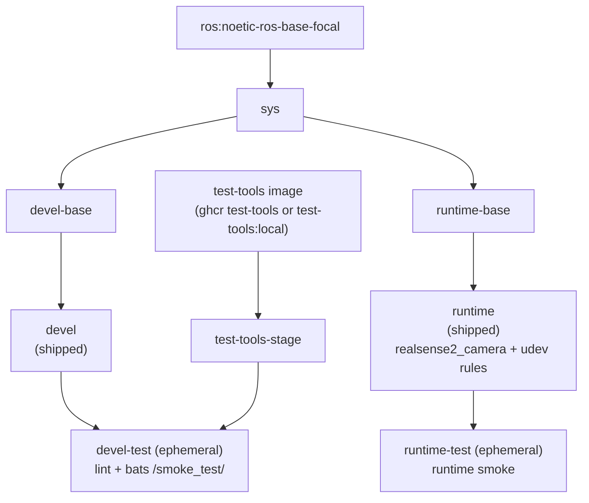

# Intel RealSense Docker Container (ROS 1 Noetic)

[](https://github.com/ycpss91255-docker/realsense_ros1/actions/workflows/main.yaml) [](./LICENSE)

**[English](README.md)** | **[繁體中文](doc/README.zh-TW.md)** | **[简体中文](doc/README.zh-CN.md)** | **[日本語](doc/README.ja.md)**

## TL;DR

An Intel RealSense camera **as a containerized ROS 1 app**: the `runtime` image's default command launches the camera node and publishes live **RGB + depth** topics. Builds **librealsense v2.55.1** (SDK) + the ros1-legacy **realsense-ros 2.3.2** wrapper from source (apt's `librealsense` 2.50.0 is too old to stream a D455 on a Pi 5) and ships the udev rules for USB access. **Noetic (Ubuntu 20.04 focal) only**, multi-arch (x86_64 + ARM64 / Raspberry Pi).

```bash
./script/install_udev_rules.sh      # once on the host (physical camera)
just build && just run -t runtime    # build + launch the camera app
# -> logs show "RealSense Node Is Up!" and depth/color streaming
```

> `just run` on its own opens the **devel** dev shell, not the camera app -- use `just run -t runtime`. See [Quick Start](#quick-start) to view the RGB-D streams.

---

## Table of Contents

- [Overview](#overview)
- [Features](#features)
- [Prerequisites](#prerequisites)
- [Quick Start](#quick-start)
- [Usage](#usage)
- [Multi-machine](#multi-machine-ros-1)
- [Uninstall / Cleanup](#uninstall--cleanup)
- [Configuration](#configuration)
- [Architecture](#architecture)
- [Smoke Tests](#smoke-tests)
- [Directory Structure](#directory-structure)

---

## Overview

Provides a reproducible ROS 1 environment for Intel RealSense depth cameras. CI
builds the image for **ROS 1 Noetic (Ubuntu 20.04 focal)** -- this is a
single-distro repo; ROS 1 Kinetic is **out of scope**. It builds **librealsense
v2.55.1** (the SDK) and the ros1-legacy **realsense-ros 2.3.2** wrapper from
source and installs them into `/opt/ros/noetic` (mirroring the apt layout). The
apt path pinned librealsense 2.50.0 (Noetic EOL), which cannot stream a D455 on
a Pi 5 (`-71` / uvc watchdog); the self-built 2.55.1 streams it at ~30 fps. The
versions are pinned and `--build-arg` overridable
(`LIBREALSENSE_VERSION` / `REALSENSE_ROS_VERSION`), and this repo is **terminal**
at this pair -- ROS 1 / Noetic / ros1-legacy are all EOL, so there is nothing
newer to chase. The upstream udev rules are baked in so USB devices come up
under the correct permissions inside the container. The multi-arch base image
supports x86_64 and ARM64 (Raspberry Pi, Jetson CPU mode).

## Features

- **Single distro**: ROS 1 Noetic (Ubuntu 20.04 focal); Kinetic is out of scope
- **Source-built RealSense stack**: librealsense v2.55.1 (SDK) + ros1-legacy realsense-ros 2.3.2 wrapper compiled from source (pinned, `--build-arg` overridable; terminal at this EOL pair). apt's 2.50.0 is too old for a D455 on the Pi 5
- **Smoke Test**: Bats tests run automatically during build to verify environment
- **Docker Compose**: single `compose.yaml` manages all targets
- **udev rules**: Pre-configured for RealSense USB device access
- **Multi-arch**: Supports x86_64 and ARM64 (RPi, Jetson CPU mode)

## Prerequisites

The user entry point is `just`, which drives Docker. Install these on the host once:

- **Docker Engine + Compose plugin.** The wrappers call `docker compose`, so the
  Compose plugin must be present. The official convenience script installs Engine +
  Buildx + Compose together:

  ```bash
  curl -fsSL https://get.docker.com | sudo sh
  sudo usermod -aG docker "$USER"   # log out/in so docker runs without sudo
  ```

  Verify with `docker compose version`. (Distro packages alone may omit Compose --
  e.g. `docker.io` without `docker-compose-v2` yields `docker: unknown command:
  docker compose`.)

- **just** (command runner). Prebuilt binary into `~/.local/bin`, no sudo:

  ```bash
  curl --proto '=https' --tlsv1.2 -sSf https://just.systems/install.sh | bash -s -- --to ~/.local/bin
  ```

  Ensure `~/.local/bin` is on `PATH`, then verify with `just --version`. Every recipe
  also has a raw fallback (`./script/<verb>.sh`) if you prefer not to install `just`.

- **(Physical camera) host udev rules.** To use a real RealSense over USB, install
  the bundled rules on the host (see [RealSense udev Rules](#realsense-udev-rules)):

  ```bash
  ./script/install_udev_rules.sh
  ```

  Without them the non-root container user cannot open the raw USB node and the SDK
  misdetects the camera -- e.g. a USB 3 device enumerating as USB 2.1 ("Reduced
  performance expected").

## Quick Start

```bash
# 1. Build
just build

# 2. (physical camera) install the host udev rules once
./script/install_udev_rules.sh

# 3. Launch the camera app. The `runtime` service's default command is
#    `roslaunch realsense2_camera rs_aligned_depth.launch`; foreground shows the node logs:
just run -t runtime
#    ...or detached:
just run -d -t runtime
```

> Use-only deployment (e.g. a Raspberry Pi that just runs the camera) can skip
> step 1: `just build` builds the **devel** image (full dev tooling -- larger)
> for development. `just run -t runtime` auto-builds the minimal runtime image on
> first use, so the camera app needs no prior `just build`.

### See the RGB-D data

**CLI** -- confirm the colour + depth topics are streaming (interactive exec has `roslaunch`/`rostopic`):

```bash
just exec -t runtime bash -ic 'rostopic hz /camera/color/image_raw'
just exec -t runtime bash -ic 'rostopic hz /camera/depth/image_rect_raw'
```

**Visual** -- view the image streams with `rqt` (the `devel` image ships `rqt_image_view`):

```bash
just run -t devel
# inside the container:
roslaunch realsense2_camera rs_aligned_depth.launch &   # start the camera
rosrun rqt_image_view rqt_image_view             # pick /camera/color/image_raw and /camera/depth/image_rect_raw
```

> `just run` with no `-t` opens the **devel** dev shell, not the camera app -- use
> `just run -t runtime` for the app. To override the launch (e.g. enable the point
> cloud), use the low-level command, which replaces the default launch:
> `docker compose run --rm runtime roslaunch realsense2_camera rs_camera.launch filters:=pointcloud`.
> The `just run -t runtime <cmd>` form of overriding is broken upstream and being
> fixed ([base#679](https://github.com/ycpss91255-docker/base/issues/679)). More
> low-level equivalents are in [Usage](#usage).

> **USB 2.x:** if the camera log shows `Reduced performance ... 2.1 port` and the
> topics carry no data, the link negotiated USB 2.x and the default profile is too
> heavy. Use a lower profile, e.g.
> `docker compose run --rm runtime roslaunch realsense2_camera rs_camera.launch depth_width:=480 depth_height:=270 depth_fps:=6 color_width:=424 color_height:=240 color_fps:=6`
> (tested on a D435 over USB 2 -- RGB + depth stream at ~6 Hz). For the full default
> profile use a USB 3 cable into a SuperSpeed port directly on the host, not via a hub.

## Usage

### Runtime

The user entry point is `just` (the repo-root `justfile` symlinks into the base
subtree). Recipes forward 1:1 to the wrapper scripts under `script/` with full
argument passthrough -- no `--` separator needed.

```bash
just build                       # Build (default: devel)
just build test                  # Build the devel-test gate
just run                         # Start (e.g. just run -d)
just exec                        # Enter running container
just stop                        # Stop and remove containers
just setup                       # Regenerate .env + compose.yaml from setup.conf

docker compose build runtime     # Equivalent low-level command
docker compose up runtime        # Start
docker compose exec runtime bash # Enter running container
```

### Custom launch args

The `runtime` image's default command is `roslaunch realsense2_camera
rs_aligned_depth.launch`. To pass launch args, use the low-level `docker compose run`
form, which replaces the default launch:

```bash
# Enable the point cloud
docker compose run --rm runtime roslaunch realsense2_camera rs_camera.launch filters:=pointcloud

# Opt out to non-aligned depth (the shipped default is now aligned)
docker compose run --rm runtime roslaunch realsense2_camera rs_camera.launch

# Reduced profile for a USB 2.x link (~6 Hz)
docker compose run --rm runtime roslaunch realsense2_camera rs_camera.launch \
  depth_width:=480 depth_height:=270 depth_fps:=6 \
  color_width:=424 color_height:=240 color_fps:=6
```

The `just run -t runtime <cmd>` override form is broken upstream
([base#679](https://github.com/ycpss91255-docker/base/issues/679)), so prefer the
`docker compose run` form above.

### Smoke tests (test stages)

Smoke tests run automatically during build; the build fails if tests fail. The
`devel-test` stage runs lint (ShellCheck + Hadolint) plus the bats suite, and
the `runtime-test` stage runs a check over the runtime image.

```bash
just build test
# or
docker compose --profile test build test
```

## Multi-machine (ROS 1)

ROS 1 uses a central master (`roscore`). To consume the camera from another
machine, run the master on one host, point every node at it, and make each node
advertise a routable address. These are per-deployment runtime values, so they
go in **`.env`** (the hand-authored workload overlay -- injected into the
container via `env_file: - .env`, applied by `just run` alone, never
regenerated, git-ignored). Machine-baked / build params (GPU, privileged,
mounts) stay in `config/docker/setup.conf`.

This repo already ships `[network] mode = host`, so the master port (`11311`)
and each node's dynamic TCPROS ports live on the host's real LAN IP -- reachable
from other machines.

**On the camera machine (slave -- e.g. a Raspberry Pi):** add to `.env`

```ini
ROS_MASTER_URI=http://<master-ip>:11311   # the host running roscore
ROS_IP=<this-machine-ip>                   # this machine's LAN IP (see note)
```

then launch with no extra flags -- compose injects `.env`:

```bash
just run -t runtime
```

When `.env` sets a remote `ROS_MASTER_URI`, the slave waits for the master
automatically: the entrypoint launches with `roslaunch --wait`, which blocks
until the master is reachable, then launches. Boot order no longer matters --
the slave may start before the master (e.g. auto-started on boot) and still
registers cleanly once the master appears, instead of coming up as an
unregistered zombie node.

A slave with a remote `ROS_MASTER_URI` can also **self-heal if the master
restarts after launch**, via an opt-in watchdog. A master rebooted on the same
port stays TCP-reachable, so roslaunch and the node keep running but silently
deregister (`rostopic list` still shows the names, `rosnode list` drops
`/camera`) -- which `restart: unless-stopped` cannot catch. When enabled, the
entrypoint supervises node registration on the *current* master and, after a
debounce window, relaunches `roslaunch --wait` so the node re-registers on the
new master.

The watchdog is **opt-in (default off)**, consistent with base
`[lifecycle] restart = no`. Enable it and tune the knobs in `.env`:

```ini
WATCHDOG_ENABLED=1                        # off by default; 1 enables the watchdog
WATCHDOG_INTERVAL=15                      # seconds between checks
WATCHDOG_TIMEOUT=5                        # per-query rosnode-list timeout, seconds
WATCHDOG_FAILURES=3                       # consecutive failures before restart (~45 s)
WATCHDOG_ROSNODE=/camera/realsense2_camera  # node whose registration is the health signal
```

The defaults are biased toward blip-immunity (a master reboot is minutes of
downtime, so a 1-2 s network blip must not trigger a restart). `just stop`
shuts the watchdog down cleanly and fast. The watchdog engages only for a
remote master launching `roslaunch`; local/unset master and other commands are
unchanged. The `--wait` gate above still applies automatically for a remote
master whether or not the watchdog is enabled.

**On the master machine:** run the master and subscribe (any ROS 1 environment,
e.g. the `ros_distro` env):

```bash
export ROS_IP=<master-ip>
roscore &
rostopic hz /camera/color/image_raw      # data arriving from the camera machine
```

> **Set `ROS_IP`.** Without it a node advertises its *hostname* to the master; a
> remote subscriber that cannot resolve that name sees the topic in `rostopic
> list` but receives no data (the classic "list works, echo hangs" symptom).
> Setting `ROS_IP` to the machine's LAN IP makes it advertise a routable address.

Verified on a Raspberry Pi 5 (camera/slave) talking to a host master over a
direct link: `/camera/color/image_raw` arrived at ~28 Hz on the master.

## Uninstall / Cleanup

```bash
just stop      # stop and remove the running containers
just prune     # remove this repo's images + dangling build cache (see `just prune -h`)
```

To fully remove what the repo placed on the host:

- **Images / build cache:** `just prune` (or `docker image rm <tag>` for a specific image).
- **Host udev rules** (only if you installed them):

  ```bash
  sudo rm -f /etc/udev/rules.d/99-realsense-libusb.rules
  sudo udevadm control --reload-rules && sudo udevadm trigger
  ```

- **The repo:** delete the cloned directory.

## Configuration

### Configuration surface (setup.conf)

The real configuration surface is `config/docker/setup.conf`. `just setup`
generates `.env` and `compose.yaml` from it, so `.env` is a generated artifact
and should not be hand-edited. Edit `setup.conf` (or `just setup-tui`) and
re-run `just setup`.

`setup.conf` is organised into sections -- `[image]`, `[build]`, `[deploy]`,
`[gui]`, `[network]`, `[security]`, `[resources]`, `[environment]`, `[tmpfs]`,
`[devices]`, `[volumes]`. For example, the `[deploy]` section carries the GPU
runtime keys (`gpu_mode`, `gpu_count`, `gpu_capabilities`, `gpu_runtime`), and
`[image]` derives the image name from naming rules rather than a literal
`image_name` key.

### RealSense udev Rules

The udev rules must be installed on the **host**, not just inside the container.
The container has no `udevd`, and a device node's permissions live on the host
`devtmpfs` inode shared through the `/dev` bind mount, so the in-image copy of
the rules does nothing on its own. Without the host rules the non-root container
user cannot open the raw USB node and the SDK misdetects the camera (reports USB
2.0, `Product Line not supported`, or fails firmware updates). See
[IntelRealSense/librealsense#12022](https://github.com/IntelRealSense/librealsense/issues/12022).

Install them once on the host with the bundled script (uses `sudo`):

```bash
./script/install_udev_rules.sh
```

It copies `config/realsense/99-realsense-libusb.rules` to `/etc/udev/rules.d/`
and reloads udev. Re-plug the camera afterwards. The container itself runs in
`privileged` mode with `/dev` mounted (see
[doc/adr/00000001-realsense-requires-privileged.md](doc/adr/00000001-realsense-requires-privileged.md)).

## Architecture

### Docker Build Stage Diagram



### Stage Description

| Stage | FROM | Purpose |
|-------|------|---------|
| `test-tools-stage` | `${TEST_TOOLS_IMAGE}` (multi-arch ghcr test-tools, or `test-tools:local`) | ShellCheck + Hadolint + Bats, not shipped |
| `sys` | `ros:noetic-ros-base-focal` | Common base: user, locale, timezone (base v0.41.0 build contract) |
| `devel-base` | `sys` | Dev tools + ROS 1 Noetic + RealSense packages |
| `devel` | `devel-base` | Shipped dev image (default CMD `bash`) |
| `devel-test` | `devel` + `test-tools-stage` | Lint + smoke tests, discarded after build (ephemeral) |
| `runtime-base` | `sys` | Minimal base (`sudo`) |
| `runtime` | `runtime-base` | Shipped runtime image: RealSense packages + udev rules (default CMD `roslaunch realsense2_camera rs_aligned_depth.launch`) |
| `runtime-test` | `runtime` | runtime smoke, discarded after build (ephemeral) |

## Smoke Tests

See [TEST.md](doc/test/TEST.md) for the automatic build-time tests,
[CAMERA.md](doc/CAMERA.md) for testing with a physical camera, and
[CALIBRATION.md](doc/CALIBRATION.md) for the Dynamic Calibration Tool.

## Directory Structure

```text
realsense_ros1/
├── Dockerfile                   # Multi-stage build
├── LICENSE
├── README.md
├── justfile -> .base/script/docker/justfile        # symlink (user entry point)
├── .hadolint.yaml -> .base/.hadolint.yaml          # symlink
├── .base/                       # base subtree (read-only)
├── script/
│   ├── entrypoint.sh            # Container entrypoint (repo-owned)
│   ├── install_udev_rules.sh    # Install RealSense udev rules on the host (repo-owned)
│   ├── check_udev_rules_sync.sh # Drift guard: vendored udev rules vs pinned SDK tag (repo-owned)
│   ├── build.sh -> ../.base/script/docker/wrapper/build.sh   # symlink
│   ├── run.sh   -> ../.base/script/docker/wrapper/run.sh     # symlink
│   ├── exec.sh  -> ../.base/script/docker/wrapper/exec.sh    # symlink
│   ├── stop.sh  -> ../.base/script/docker/wrapper/stop.sh    # symlink
│   ├── prune.sh -> ../.base/script/docker/wrapper/prune.sh   # symlink
│   ├── setup.sh -> ../.base/script/docker/wrapper/setup.sh   # symlink
│   ├── setup_tui.sh -> ../.base/script/docker/wrapper/setup_tui.sh  # symlink
│   └── hooks/                   # pre/ + post/ wrapper hooks
├── config/
│   ├── docker/
│   │   └── setup.conf           # configuration surface (.env/compose.yaml generated from this)
│   ├── shell/
│   │   └── bashrc.d/10-ros-source.sh  # source ROS for interactive shells
│   └── realsense/
│       └── 99-realsense-libusb.rules  # RealSense udev rules
├── doc/
│   ├── README.zh-TW.md          # Traditional Chinese
│   ├── README.zh-CN.md          # Simplified Chinese
│   ├── README.ja.md             # Japanese
│   ├── adr/                     # Architecture Decision Records
│   ├── CAMERA.md                # manual testing with a physical camera
│   ├── CALIBRATION.md           # Dynamic Calibration Tool guide
│   ├── changelog/CHANGELOG.md
│   └── test/
│       └── TEST.md              # automatic build-time smoke tests
├── .github/workflows/
│   └── main.yaml                # CI (calls base reusable build/release workers)
└── test/
    └── smoke/                   # repo-owned bats tests
        ├── ros_env.bats
        └── install_udev_rules.bats   # (helper + more .bats come from .base/test/smoke/)
```
