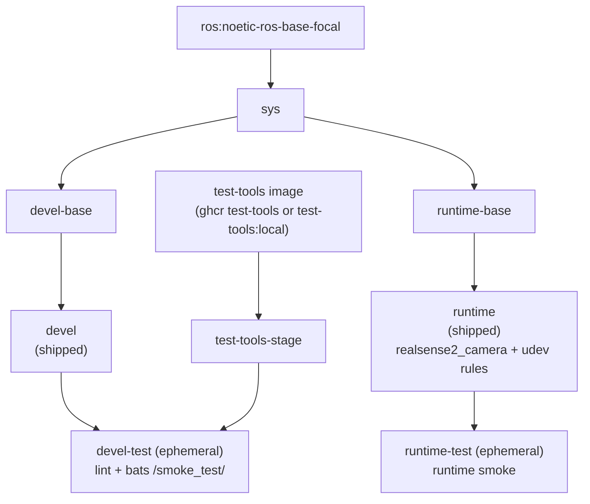

**[English](../README.md)** | **[繁體中文](README.zh-TW.md)** | **[简体中文](README.zh-CN.md)** | **[日本語](README.ja.md)**

# Intel RealSense Docker コンテナ（ROS 1 Noetic）

[](https://github.com/ycpss91255-docker/realsense_ros1/actions/workflows/main.yaml) [](../LICENSE)

## TL;DR

コンテナ化された ROS 1 RealSense カメラ **アプリ**：`runtime` イメージのデフォルトコマンドがカメラノードを launch し、リアルタイムの **RGB + Depth** トピックを配信します。**librealsense v2.55.1**（SDK）＋ ros1-legacy **realsense-ros 2.3.2** ラッパーをソースからビルドし（apt の `librealsense` 2.50.0 は古すぎて Pi 5 上で D455 をストリームできません）、USB アクセス用の udev ルールを同梱します。**Noetic（Ubuntu 20.04 focal）のみ**、マルチアーキ（x86_64 + ARM64 / Raspberry Pi）。

```bash
./script/install_udev_rules.sh      # once on the host (physical camera)
just build && just run -t runtime    # build + launch the camera app
# -> logs show "RealSense Node Is Up!" and depth/color streaming
```

> `just run` 単体は **devel** 開発シェルを開くだけでカメラアプリではありません -- `just run -t runtime` を使ってください。RGB-D ストリームの確認は [クイックスタート](#クイックスタート) を参照。

---

## 目次

- [概要](#概要)
- [機能](#機能)
- [前提条件](#prerequisites)
- [クイックスタート](#クイックスタート)
- [使い方](#使い方)
- [マルチマシン](#multi-machine-ros-1)
- [アンインストール / クリーンアップ](#uninstall--cleanup)
- [設定](#設定)
- [アーキテクチャ](#アーキテクチャ)
- [Smoke Tests](#smoke-tests)
- [ディレクトリ構成](#ディレクトリ構成)

---

## 概要

Intel RealSense 深度カメラ向けに、再現可能な ROS 1 環境を提供します。CI は **ROS 1 Noetic（Ubuntu 20.04 focal）** でイメージをビルドします -- 本リポジトリは単一ディストロで、ROS 1 Kinetic は **対象外** です。**librealsense v2.55.1**（SDK）と ros1-legacy **realsense-ros 2.3.2** ラッパーをソースからビルドし、`/opt/ros/noetic` にインストールします（apt のレイアウトに合わせています）。apt の経路は librealsense 2.50.0（Noetic EOL）に固定され、Pi 5 上で D455 をストリームできません（`-71` / uvc watchdog）。自前ビルドの 2.55.1 は約 30 fps でストリームします。バージョンは固定されており `--build-arg`（`LIBREALSENSE_VERSION` / `REALSENSE_ROS_VERSION`）で上書き可能です。本リポジトリはこの組み合わせで **終端版** です —— ROS 1 / Noetic / ros1-legacy はすべて EOL で、追うべき新しいバージョンはありません。さらに上流の udev ルールを焼き込んでいるため、USB デバイスがコンテナ内で正しい権限のもとで起動します。マルチアーキテクチャのベースイメージは x86_64 と ARM64（Raspberry Pi、Jetson CPU モード）をサポートします。

## 機能

- **単一ディストロ**：ROS 1 Noetic（Ubuntu 20.04 focal）；Kinetic は対象外
- **ソースビルドの RealSense スタック**：librealsense v2.55.1（SDK）＋ ros1-legacy realsense-ros 2.3.2 ラッパーをソースからコンパイル（バージョン固定、`--build-arg` で上書き可能。この EOL の組み合わせで終端版）。apt の 2.50.0 は古すぎて Pi 5 上で D455 を駆動できません
- **Smoke Test**：Bats テストがビルド時に自動実行され、環境を検証
- **Docker Compose**：単一の `compose.yaml` で全ターゲットを管理
- **udev ルール**：RealSense USB デバイスアクセス用に事前設定済み
- **マルチアーキテクチャ**：x86_64 と ARM64（RPi、Jetson CPU モード）をサポート

## Prerequisites

ユーザーのエントリポイントは `just` で、これが Docker を駆動します。以下をホストに一度だけインストールしてください：

- **Docker Engine + Compose plugin。** ラッパーは `docker compose` を呼び出すため、
  Compose plugin が必要です。公式の便利スクリプトは Engine + Buildx + Compose を
  まとめてインストールします：

  ```bash
  curl -fsSL https://get.docker.com | sudo sh
  sudo usermod -aG docker "$USER"   # log out/in so docker runs without sudo
  ```

  `docker compose version` で確認してください。（ディストロのパッケージ単体では
  Compose が欠けることがあります -- 例：`docker-compose-v2` なしの `docker.io` では
  `docker: unknown command: docker compose` になります。）

- **just**（コマンドランナー）。ビルド済みバイナリを `~/.local/bin` へ、sudo 不要：

  ```bash
  curl --proto '=https' --tlsv1.2 -sSf https://just.systems/install.sh | bash -s -- --to ~/.local/bin
  ```

  `~/.local/bin` が `PATH` にあることを確認し、`just --version` で確認してください。
  `just` をインストールしたくない場合のために、各レシピには生のフォールバック
  （`./script/<verb>.sh`）も用意されています。

- **（実機カメラ）ホストの udev ルール。** USB 経由で実機の RealSense を使うには、
  付属のルールをホストにインストールします（[RealSense udev ルール](#realsense-udev-rules) を参照）：

  ```bash
  ./script/install_udev_rules.sh
  ```

  これがないと、コンテナ内の非 root ユーザーは raw USB ノードを開けず、SDK がカメラを
  誤検出します -- 例：USB 3 デバイスが USB 2.1 として列挙される（"Reduced
  performance expected"）。

## クイックスタート

```bash
# 1. Build
just build

# 2. (physical camera) install the host udev rules once
./script/install_udev_rules.sh

# 3. Launch the camera app. The `runtime` service's default command is
#    `roslaunch realsense2_camera rs_aligned_depth.launch`; foreground shows the node logs:
just run -t runtime
#    ...or detached:
just run -d -t runtime
```

> カメラを使うだけのデプロイ機（例：カメラだけ動かす Raspberry Pi）は step 1 を省略できます。
> `just build` は開発用の **devel** イメージ（フル開発ツール -- やや大きい）をビルドします。
> `just run -t runtime` は初回利用時に最小限の runtime イメージを自動ビルドするため、
> カメラアプリに事前の `just build` は不要です。

### See the RGB-D data

**CLI** -- カラー + Depth トピックが配信されているか確認します（インタラクティブな exec には `roslaunch`/`rostopic` があります）：

```bash
just exec -t runtime bash -ic 'rostopic hz /camera/color/image_raw'
just exec -t runtime bash -ic 'rostopic hz /camera/depth/image_rect_raw'
```

**Visual** -- `rqt` で画像ストリームを表示します（`devel` イメージには `rqt_image_view` が同梱）：

```bash
just run -t devel
# inside the container:
roslaunch realsense2_camera rs_aligned_depth.launch &   # start the camera
rosrun rqt_image_view rqt_image_view             # pick /camera/color/image_raw and /camera/depth/image_rect_raw
```

> `-t` なしの `just run` は **devel** 開発シェルを開くだけでカメラアプリではありません -- アプリには
> `just run -t runtime` を使ってください。launch 引数を上書きするには（例: point cloud を有効化）、
> デフォルトの launch を置き換える低レベルコマンドを使います：
> `docker compose run --rm runtime roslaunch realsense2_camera rs_camera.launch filters:=pointcloud`。
> `just run -t runtime <cmd>` 形式の上書きは upstream で壊れており、修正中です
> （[base#679](https://github.com/ycpss91255-docker/base/issues/679)）。他の低レベルの等価コマンドは
> [使い方](#使い方) を参照。

> **USB 2.x:** カメラの log に `Reduced performance ... 2.1 port` が出てトピックにデータが
> 流れない場合、リンクが USB 2.x でネゴシエートされ、デフォルト profile が重すぎます。
> 低めの profile を使ってください。例：
> `docker compose run --rm runtime roslaunch realsense2_camera rs_camera.launch depth_width:=480 depth_height:=270 depth_fps:=6 color_width:=424 color_height:=240 color_fps:=6`
> （D435 over USB 2 で実測 -- RGB + depth が ~6 Hz で安定）。完全なデフォルト profile には、
> hub を介さず USB 3 ケーブルでホストの SuperSpeed ポートへ直結してください。

## 使い方

### ランタイム

ユーザーのエントリポイントは `just` です（リポジトリルートの `justfile` は base
サブツリーへのシンボリックリンク）。各レシピは `script/` 配下のラッパースクリプトに
1:1 で転送され、引数はそのまま渡されます。`--` 区切りは不要です。

```bash
just build                       # ビルド（デフォルト：devel）
just build test                  # devel-test ゲートをビルド
just run                         # 起動（例：just run -d）
just exec                        # 実行中のコンテナに入る
just stop                        # コンテナを停止・削除
just setup                       # setup.conf から .env + compose.yaml を再生成

docker compose build runtime     # 同等の低レベルコマンド
docker compose up runtime        # 起動
docker compose exec runtime bash # 実行中のコンテナに入る
```

### カスタム launch 引数

`runtime` イメージのデフォルトコマンドは `roslaunch realsense2_camera
rs_aligned_depth.launch` です。launch 引数を渡すには、デフォルトの launch を置き換える
低レベルの `docker compose run` 形式を使います：

```bash
# point cloud を有効化
docker compose run --rm runtime roslaunch realsense2_camera rs_camera.launch filters:=pointcloud

# 非アラインの depth に戻す（出荷デフォルトはアライン済み）
docker compose run --rm runtime roslaunch realsense2_camera rs_camera.launch

# USB 2.x リンク向けの低減 profile（~6 Hz）
docker compose run --rm runtime roslaunch realsense2_camera rs_camera.launch \
  depth_width:=480 depth_height:=270 depth_fps:=6 \
  color_width:=424 color_height:=240 color_fps:=6
```

`just run -t runtime <cmd>` 形式の上書きは upstream で壊れているため
（[base#679](https://github.com/ycpss91255-docker/base/issues/679)）、上記の
`docker compose run` 形式を使ってください。

### Smoke tests（test ステージ）

Smoke tests はビルド時に自動実行されます。テスト失敗時はビルドも失敗します。
`devel-test` ステージは lint（ShellCheck + Hadolint）と bats スイートを実行し、
`runtime-test` ステージは runtime イメージに対してチェックを実行します。

```bash
just build test
# または
docker compose --profile test build test
```

## Multi-machine (ROS 1)

ROS 1 は中央 master（`roscore`）を使います。別のマシンからカメラを利用するには、
いずれか 1 台の host で master を実行し、すべてのノードをそれに向け、各ノードが
ルーティング可能なアドレスを通告するようにします。これらはデプロイごとの runtime
値なので、**`.env`**（手書きの workload overlay -- `env_file: - .env` でコンテナに
注入され、`just run` 単独で適用され、再生成されることはなく、git で無視される）に
記述します。machine-baked / build パラメータ（GPU、privileged、マウント）は
`config/docker/setup.conf` に残します。

このリポジトリはすでに `[network] mode = host` を同梱しているため、master の
port（`11311`）と各ノードの動的 TCPROS port は host の実際の LAN IP 上にあり、
他のマシンから到達できます。

**カメラ側マシン（slave -- 例: Raspberry Pi）：** `.env` に以下を追加します

```ini
ROS_MASTER_URI=http://<master-ip>:11311   # the host running roscore
ROS_IP=<this-machine-ip>                   # this machine's LAN IP (see note)
```

その後、追加フラグなしで起動します -- compose が `.env` を注入します：

```bash
just run -t runtime
```

`.env` にリモートの `ROS_MASTER_URI` が設定されている場合、slave は master を
自動的に待ちます。entrypoint は `roslaunch --wait` で起動し、master に到達できる
ようになるまでブロックしてから起動します。この **boot gate** には timeout もノブも
なく、待機は常に無限です。起動順序はもう問題になりません -- slave は master より
先に起動しても（例: 起動時に自動起動）、master が現れた時点できれいに登録され、
未登録のゾンビノードになることはありません。

リモートの `ROS_MASTER_URI` を持つ slave は、オプトインの watchdog により
**master が起動後に再起動しても自己修復できます**。同じポートで再起動した master は
TCP 到達可能なままなので、roslaunch とノードは動き続けたまま静かに登録解除されます
（`rostopic list` には名前が残るが `rosnode list` から `/camera` が消える）-- これは
`restart: unless-stopped` では捕捉できません。有効化すると、entrypoint は*現在の*
master 上のノード登録を監視し、デバウンス窓の後に `roslaunch --wait` を再起動して
新しい master へ再登録させます。

watchdog は **オプトイン（デフォルト無効）** で、base の `[lifecycle] restart = no`
と整合します。`.env` で有効化しノブを調整します：

```ini
WATCHDOG_ENABLED=1                        # デフォルト無効；1 で watchdog を有効化
WATCHDOG_INTERVAL=15                      # チェック間隔（秒）
WATCHDOG_TIMEOUT=5                        # rosnode list クエリごとのタイムアウト（秒）
WATCHDOG_FAILURES=3                       # 再起動までの連続失敗回数（~45 秒）
WATCHDOG_STARTUP_DEADLINE=300             # phase-1 の保険：未登録のまま何秒経過したら再起動するか
WATCHDOG_ROSNODE=/camera/realsense2_camera  # ヘルスシグナルとなるノード
```

**これらは 2 つの独立したフェーズです。** 上記の boot gate は master の*出現*を待ち
（常に無限）、watchdog は起動*後*の復旧のみを担当します。さらに watchdog 自身も、
監視対象ノードがこの launch 以降に*一度でも*登録されたかどうかで、内部的に 2 つの
フェーズに分かれます。

- **起動フェーズ（まだ未登録）：** master が遅い、ノードがまだ起動していないのは
  正常なので、unreachable も deregistered もカウントしません。
  `WATCHDOG_STARTUP_DEADLINE`（デフォルト 300 秒、launch からの経過秒数）だけが再起動を
  強制します -- これは「いつまでも登録できない」（引数ミス、ノードの crash loop）に
  対する保険です。これにより起動の許容時間がカメラ初期化時間（プラットフォーム依存）
  から切り離されます。
- **定常フェーズ（少なくとも一度は登録済み）：**
  - **確定的な登録解除**（master は応答するがノードが消えている。例：master の再起動）
    -> 次のチェックで再起動し、デバウンスしません（待っても新しい情報は得られません）。
  - **単なる unreachable**（クエリのタイムアウト）-> 一時的なネットワークの揺らぎを
    吸収するため、引き続き `WATCHDOG_FAILURES` 回の連続失敗（およそ
    `WATCHDOG_INTERVAL × WATCHDOG_FAILURES`）でデバウンスします。

**重要な訂正：** 既存の文章は watchdog の再起動許容度を `INTERVAL × FAILURES` と
説明していましたが、これは現在 unreachable の揺らぎのデバウンスに**のみ**当てはまります。
確定的な登録解除は単一の `INTERVAL` 内で復旧し、すべての失敗が 45 秒のウィンドウを待つ
わけではありません。`WATCHDOG_STARTUP_DEADLINE` は保険であって調整用パラメータでは
ありません -- 正常な起動より長ければよく、`INTERVAL` とは独立です。

デフォルトはブリップ耐性重視です（master 再起動は数分のダウンなので、1-2 秒の
ネットワークブリップで再起動してはならない）。`just stop` は watchdog をきれいかつ
高速に停止します。watchdog はリモート master で `roslaunch` を起動する場合のみ有効で、
ローカル／未設定の master やその他のコマンドは変更されません。watchdog の有効・無効
にかかわらず、上記の `--wait` ゲートはリモート master に対して自動的に適用されます。

**master 側マシン：** master を実行して購読します（任意の ROS 1 環境、例えば
`ros_distro` 環境）：

```bash
export ROS_IP=<master-ip>
roscore &
rostopic hz /camera/color/image_raw      # data arriving from the camera machine
```

> **`ROS_IP` を必ず設定してください。** これがないと、ノードは自身の*ホスト名*を
> master に通告します。その名前を解決できないリモートの購読者は、`rostopic list`
> ではトピックを見られても、データは一切受信できません（典型的な「list は出るが
> echo がハングする」症状）。`ROS_IP` をそのマシンの LAN IP に設定すると、
> ルーティング可能なアドレスを通告するようになります。

Raspberry Pi 5（カメラ/slave）から直結リンク経由で host master に接続して実測：
`/camera/color/image_raw` が master 側に ~28 Hz で届きました。

## Uninstall / Cleanup

```bash
just stop      # stop and remove the running containers
just prune     # remove this repo's images + dangling build cache (see `just prune -h`)
```

リポジトリがホストに配置したものを完全に削除するには：

- **イメージ / ビルドキャッシュ：** `just prune`（特定のイメージは `docker image rm <tag>`）。
- **ホストの udev ルール**（インストールした場合のみ）：

  ```bash
  sudo rm -f /etc/udev/rules.d/99-realsense-libusb.rules
  sudo udevadm control --reload-rules && sudo udevadm trigger
  ```

- **リポジトリ：** クローンしたディレクトリを削除します。

## 設定

### 設定サーフェス（setup.conf）

実際の設定サーフェスは `config/docker/setup.conf` です。`just setup` がそこから
`.env` と `compose.yaml` を生成するため、`.env` は生成された成果物であり、手で
編集すべきではありません。`setup.conf` を編集（または `just setup-tui`）してから
`just setup` を再実行してください。

`setup.conf` はセクションに分かれています -- `[image]`、`[build]`、`[deploy]`、
`[gui]`、`[network]`、`[security]`、`[resources]`、`[environment]`、`[tmpfs]`、
`[devices]`、`[volumes]`。たとえば `[deploy]` セクションは GPU ランタイムキー
（`gpu_mode`、`gpu_count`、`gpu_capabilities`、`gpu_runtime`）を持ち、`[image]` は
リテラルな `image_name` キーではなく命名規則からイメージ名を導出します。

### RealSense udev ルール

udev ルールはコンテナ内だけでなく **ホスト** にインストールする必要があります。
コンテナには `udevd` がなく、デバイスノードの権限は `/dev` bind mount で共有される
ホストの `devtmpfs` inode 上にあるため、イメージに焼き込まれたルールだけでは機能
しません。ホストのルールがないと、コンテナ内の非 root ユーザーは raw USB ノードを
開けず、SDK がカメラを誤検出します（USB 2.0、`Product Line not supported` を報告、
またはファームウェア更新に失敗）。[IntelRealSense/librealsense#12022](https://github.com/IntelRealSense/librealsense/issues/12022)
を参照してください。

付属スクリプトでホストに一度だけインストールします（`sudo` を使用）：

```bash
./script/install_udev_rules.sh
```

スクリプトは `config/realsense/udev/99-realsense-libusb.rules` を `/etc/udev/rules.d/`
にコピーして udev をリロードします。その後カメラを再接続してください。コンテナ自体は
`privileged` モードで実行され、`/dev` がマウントされます
（[doc/adr/00000001-realsense-requires-privileged.md](adr/00000001-realsense-requires-privileged.md) を参照）。

### カメラ設定（Camera Config）

有効なカメラ profile はリポジトリ直下の `camera.yaml` **symlink** で選択します
（`app/ros1_bridge` の `bridge.yaml` に倣っています）。デフォルト対象は
`config/realsense/yaml/none.yaml` という**空ファイル**で、runtime image は従来どおり
標準の上流デフォルト（640x480x30）をストリームします。Dockerfile はリンク対象を
`/camera_config.yaml` に COPY し、そのファイルが空でないとき entrypoint は起動コマンド
に `config_file:=/camera_config.yaml` を追加します。空ならデフォルトの `CMD` のままです。

profile を有効化するには symlink を張り替えるか build arg を使います：

```bash
ln -sf config/realsense/yaml/usb2_640x480p15fps.yaml camera.yaml   # USB 2 profile を有効化
ln -sf config/realsense/yaml/none.yaml camera.yaml   # 標準デフォルトへ戻す
just build --build-arg CAMERA_CONFIG=config/realsense/yaml/usb2_640x480p15fps.yaml
```

#### profile の適用方法（`rs_camera_config.launch`）

ROS 1 `realsense-ros`（2.3.2）には `config_file` 引数がないため、リポジトリは
`config/realsense/launch/` に `rs_camera_config.launch`（`/rs_camera_config.launch`
として焼き込み）を持ちます。標準の `realsense2_camera/rs_aligned_depth.launch` を
`<include>` し（変更なし）、`initial_reset` を node パラメータとして設定し、空でない
`config_file:=` が渡されたとき include の**後**で `<rosparam command="load">` によって
その YAML を node のプライベート namespace に読み込みます。roslaunch は node 起動前に
全パラメータを設定し後勝ちのため、YAML が launch デフォルトを上書きします
（`roslaunch --dump-params` で検証済み）。YAML 内のパラメータは node のフラットな
ROS 1 名（`color_width`、`depth_fps`、`enable_infra1` ...）を使い、ROS 2 のドット式
キーではありません。

#### カスタム launch / 出力トピック remap（デプロイ）

launch は階層化されており、デプロイが **image を変えず・env も使わず** にカスタマイズ
（出力トピック名の変更、ノード追加）できます:

| 焼き込みパス | 役割 |
|--------------|------|
| `/rs_camera_config.launch` | 我々の config（上記）-- **immutable** |
| `/rs_camera.launch` | runtime CMD が実行するファイル -- デフォルトは我々の config を `<include>` するだけ、remap なし |
| `/rs_camera_remap.example.launch` | コピー用テンプレート:`<remap>` + 我々の config を `<include>` |

出力を remap するには（例:下流が独自のトピック名を要求）:
`config/realsense/rs_camera_remap.example.launch` をコピーし、2 つの
`<remap>` 行を編集し、`config/docker/setup.conf` でそのコピーを `/rs_camera.launch` に
bind-mount します:

```ini
[volumes]
mount_1 = /host/path/rs_camera.launch:/rs_camera.launch:ro
```

override は immutable な `/rs_camera_config.launch` を `<include>` する（bringup を複製
せず drift しない）。`<remap>` は include の**前**に宣言してこそ realsense ノードに届き
ます。壊れた override は roslaunch で**明示的にエラー（fallback なし）**;mount 前に
`xmllint` してください。同梱テンプレートは CI で構文検証されます;編集したコピーは
自己責任です。[ADR 00000002](adr/00000002-camera-launch-override-for-remap.md) を参照。

#### `yaml/` -- 独自 profile

profile は `config/realsense/yaml/` に置かれます。命名は
`<link>_<WxH>p<fps>fps.yaml`：color 解像度ごとに 1 ファイルで、その解像度における
リンクの最大 fps を使います。depth は常に 1280x720（D455 の最高 depth 解像度）で
30 fps 上限（720p depth の上限）です。IR（`enable_infra1/2`）と IMU
（`enable_gyro/accel`）はすべての profile でオフ、整列深度はオンです。

| ファイル | Color | 整列深度 |
|----------|-------|----------|
| `none.yaml` | 空（0 bytes）-- 標準の上流デフォルト（640x480x30）。デフォルト。 | -- |
| `usb3_1280x720p30fps.yaml` | 1280x720@30 | 1280x720@30 |
| `usb3_848x480p60fps.yaml` | 848x480@60 | 1280x720@30 |
| `usb3_640x480p60fps.yaml` | 640x480@60 | 1280x720@30 |
| `usb3_424x240p90fps.yaml` | 424x240@90 | 1280x720@30 |
| `usb2_1280x720p6fps.yaml` | 1280x720@6 | 1280x720@6 |
| `usb2_640x480p15fps.yaml` | 640x480@15 | 1280x720@15 |
| `usb2_424x240p30fps.yaml` | 424x240@30 | 1280x720@30 |

`usb3_*` profile は D455 を USB 3 リンクに接続し `rs-enumerate-devices` で検証済みです。
`usb2_*` profile は**未検証（UNVERIFIED）**です：USB 2 のホワイトリストは列挙して
おらず（カメラは USB 3 リンク上でした）、720p depth は 480 Mbps リンクの帯域を超える
か、そもそも提供されない可能性があります -- 依存する前に実機の USB 2 リンクで各々を
検証してください。D435/D455 は USB 2 接続では標準の 640x480x30 color + depth を維持
できず（カメラはリンクをネゴシエートするが 30 fps では **0 フレーム**しか出さない）、
これが `usb2_*` profile が fps を下げ IR + IMU をオフにする理由です。

#### `udev/` -- 上流由来のファイル

| ファイル | 由来 | ドリフトチェック |
|----------|------|-------------------|
| `udev/99-realsense-libusb.rules` | `librealsense` SDK の `config/99-realsense-libusb.rules`（ピン留め `LIBREALSENSE_VERSION`）から **verbatim** vendored | `script/check_udev_rules_sync.sh` |

udev ルールはホストの USB アクセスルールです（前節参照）；Dockerfile はこれをイメージ内の
`/etc/udev/rules.d/` にも焼き込みます。

## アーキテクチャ

### Docker ビルドステージ図



### ステージ説明

| ステージ | FROM | 用途 |
|----------|------|------|
| `test-tools-stage` | `${TEST_TOOLS_IMAGE}`（マルチアーキの ghcr test-tools、または `test-tools:local`） | ShellCheck + Hadolint + Bats、出荷しない |
| `sys` | `ros:noetic-ros-base-focal` | 共通ベース：ユーザー、ロケール、タイムゾーン（base v0.41.0 build contract） |
| `devel-base` | `sys` | 開発ツール + ROS 1 Noetic + RealSense パッケージ |
| `devel` | `devel-base` | 出荷する開発イメージ（デフォルト CMD `bash`） |
| `devel-test` | `devel` + `test-tools-stage` | Lint + smoke tests、ビルド後に破棄（一時的） |
| `runtime-base` | `sys` | 最小ベース（`sudo`） |
| `runtime` | `runtime-base` | 出荷するランタイムイメージ：RealSense パッケージ + udev ルール（デフォルト CMD `roslaunch /rs_camera.launch initial_reset:=true`、我々の `/rs_camera_config.launch` + 標準の `rs_aligned_depth.launch` を include） |
| `runtime-test` | `runtime` | runtime smoke、ビルド後に破棄（一時的） |

## Smoke Tests

ビルド時の自動テストは [TEST.md](test/TEST.md)、実機カメラでのテストは [CAMERA.ja.md](CAMERA.ja.md)、動的キャリブレーションツールは [CALIBRATION.ja.md](CALIBRATION.ja.md) を参照。

## ディレクトリ構成

```text
realsense_ros1/
├── Dockerfile                   # マルチステージビルド（事前ビルド済み librealsense SDK イメージを FROM）
├── docker/
│   └── librealsense/
│       └── Dockerfile           # 事前ビルド librealsense SDK ソース（一度だけビルドし GHCR に公開）
├── LICENSE
├── README.md
├── justfile -> .base/script/docker/justfile        # シンボリックリンク（ユーザーエントリポイント）
├── .hadolint.yaml -> .base/.hadolint.yaml          # シンボリックリンク
├── .base/                       # base サブツリー（読み取り専用）
├── script/
│   ├── entrypoint.sh            # コンテナエントリポイント（リポジトリ所有）
│   ├── install_udev_rules.sh    # ホストに RealSense udev ルールをインストール（リポジトリ所有）
│   ├── check_udev_rules_sync.sh # ドリフトガード：同梱 udev ルール vs 固定 SDK タグ（リポジトリ所有）
│   ├── build.sh -> ../.base/script/docker/wrapper/build.sh   # シンボリックリンク
│   ├── run.sh   -> ../.base/script/docker/wrapper/run.sh     # シンボリックリンク
│   ├── exec.sh  -> ../.base/script/docker/wrapper/exec.sh    # シンボリックリンク
│   ├── stop.sh  -> ../.base/script/docker/wrapper/stop.sh    # シンボリックリンク
│   ├── prune.sh -> ../.base/script/docker/wrapper/prune.sh   # シンボリックリンク
│   ├── setup.sh -> ../.base/script/docker/wrapper/setup.sh   # シンボリックリンク
│   ├── setup_tui.sh -> ../.base/script/docker/wrapper/setup_tui.sh  # シンボリックリンク
│   └── hooks/                   # pre/ + post/ ラッパーフック
├── camera.yaml -> config/realsense/yaml/none.yaml  # symlink（有効なカメラ設定; デフォルトは stock）
├── config/
│   ├── docker/
│   │   └── setup.conf           # 設定サーフェス（.env/compose.yaml はここから生成）
│   ├── shell/
│   │   └── bashrc.d/10-ros-source.sh  # インタラクティブシェル向けに ROS を source
│   └── realsense/              # type-first レイアウト：yaml / launch / udev
│       ├── rs_camera_remap.example.launch  # コピー用 remap テンプレート（.example、base の Dockerfile.example に対応）
│       ├── yaml/               # 独自のカメラ profile（ROS 1 パラメータ形式）；none + USB2/USB3 プリセット
│       │   ├── none.yaml               # 空 = stock 上流デフォルト（デフォルト）
│       │   ├── usb3_1280x720p30fps.yaml  # D455（USB 3）で検証済み
│       │   ├── usb3_848x480p60fps.yaml   # D455（USB 3）で検証済み
│       │   ├── usb3_640x480p60fps.yaml   # D455（USB 3）で検証済み
│       │   ├── usb3_424x240p90fps.yaml   # D455（USB 3）で検証済み
│       │   ├── usb2_1280x720p6fps.yaml   # USB 2 未検証（ホワイトリスト未列挙）
│       │   ├── usb2_640x480p15fps.yaml   # USB 2 未検証（ホワイトリスト未列挙）
│       │   └── usb2_424x240p30fps.yaml   # USB 2 未検証（ホワイトリスト未列挙）
│       ├── launch/             # カメラ launch 階層（/ に焼き込み）
│       │   ├── rs_camera_config.launch  # 我々の config：rs_aligned_depth + config_file/initial_reset を include（immutable）
│       │   └── rs_camera.launch         # entrypoint が実行：我々の config を include（デプロイはこれに bind-mount して remap）
│       └── udev/               # ホストの USB アクセスルール
│           └── 99-realsense-libusb.rules  # RealSense udev ルール（librealsense SDK から vendored）
├── doc/
│   ├── README.zh-TW.md          # 繁体字中国語
│   ├── README.zh-CN.md          # 簡体字中国語
│   ├── README.ja.md             # 日本語
│   ├── adr/                     # アーキテクチャ決定記録（ADR）
│   ├── CAMERA.md                # 実機カメラでの手動テスト（+ .zh-TW/.zh-CN/.ja）
│   ├── CALIBRATION.md           # 動的キャリブレーションツール解説（+ .zh-TW/.zh-CN/.ja）
│   ├── changelog/CHANGELOG.md
│   └── test/
│       └── TEST.md              # ビルド時の自動 smoke テスト
├── .github/workflows/
│   ├── main.yaml                # CI（base の再利用可能な build/release ワーカーを呼び出す）
│   └── build-librealsense.yaml  # 事前ビルド librealsense SDK イメージを GHCR に公開
└── test/
    └── smoke/                   # リポジトリ所有の bats テスト
        ├── ros_env.bats
        └── install_udev_rules.bats   # （ヘルパーと追加の .bats は .base/test/smoke/ から）
```
