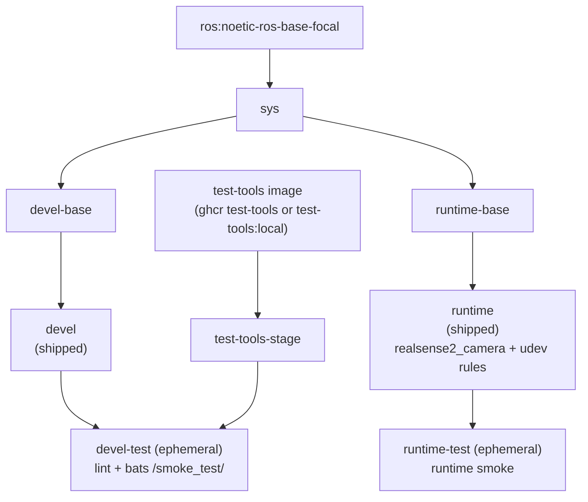

**[English](../README.md)** | **[繁體中文](README.zh-TW.md)** | **[简体中文](README.zh-CN.md)** | **[日本語](README.ja.md)**

# Intel RealSense Docker 容器（ROS 1 Noetic）

[](https://github.com/ycpss91255-docker/realsense_ros1/actions/workflows/main.yaml) [](../LICENSE)

## TL;DR

这是一个容器化的 ROS 1 RealSense 相机 **app**：`runtime` 镜像的默认命令就会 launch 相机节点、发布实时 **RGB + Depth** topic。通过 apt 安装 `ros-noetic-realsense2-camera` / `ros-noetic-realsense2-description`（会以传递依赖方式拉入 `librealsense2`），并内含 udev 规则以供 USB 访问。**仅支持 Noetic（Ubuntu 20.04 focal）**、多架构（x86_64 + ARM64 / 树莓派）。

```bash
./script/install_udev_rules.sh      # host 装一次（实体相机）
just build && just run -t runtime    # build + 启动相机 app
# -> log 显示 "RealSense Node Is Up!" 与 depth/color 流
```

> `just run` 自身只开 **devel** 开发 shell、不是相机 app —— 要用 `just run -t runtime`。见 [快速开始](#快速开始) 观看 RGB-D 流。

---

## 目录

- [概述](#概述)
- [功能特性](#功能特性)
- [前置条件](#prerequisites)
- [快速开始](#快速开始)
- [使用方式](#使用方式)
- [多机连接](#multi-machine-ros-1)
- [卸载 / 清理](#uninstall--cleanup)
- [配置](#配置)
- [架构](#架构)
- [Smoke Tests](#smoke-tests)
- [目录结构](#目录结构)

---

## 概述

为 Intel RealSense 深度相机提供可复现的 ROS 1 环境。CI 为 **ROS 1 Noetic（Ubuntu 20.04 focal）** 构建镜像 —— 本 repo 为单一发行版；ROS 1 Kinetic **不在范围内**。镜像从 ROS apt 软件源安装 `ros-noetic-realsense2-camera` 和 `ros-noetic-realsense2-description` 软件包（`librealsense2` 库会作为其依赖以传递方式拉入），并将上游 udev 规则烤入镜像，使 USB 设备在容器内以正确的权限挂载。多架构基础镜像支持 x86_64 和 ARM64（树莓派、Jetson CPU 模式）。

## 功能特性

- **单一发行版**：ROS 1 Noetic（Ubuntu 20.04 focal）；Kinetic 不在范围内
- **Apt 安装**：从 ROS apt 软件源安装 `ros-noetic-realsense2-camera` 和 `ros-noetic-realsense2-description`（`librealsense2` 以传递依赖方式拉入）
- **Smoke Test**：Bats 测试在构建时自动执行，验证环境正确性
- **Docker Compose**：单一 `compose.yaml` 管理所有目标
- **udev 规则**：预配置 RealSense USB 设备访问权限
- **多架构支持**：支持 x86_64 和 ARM64（RPi、Jetson CPU 模式）

## Prerequisites

用户入口是 `just`，由它驱动 Docker。请在 host 上一次性安装以下工具：

- **Docker Engine + Compose plugin。** wrapper 脚本会调用 `docker compose`，因此必须
  装有 Compose plugin。官方便捷脚本会一并安装 Engine + Buildx + Compose：

  ```bash
  curl -fsSL https://get.docker.com | sudo sh
  sudo usermod -aG docker "$USER"   # log out/in so docker runs without sudo
  ```

  用 `docker compose version` 验证。（仅装发行版软件包可能缺少 Compose ——
  例如只装 `docker.io` 而没有 `docker-compose-v2`，会得到 `docker: unknown command:
  docker compose`。）

- **just**（命令运行器）。将预编译二进制安装到 `~/.local/bin`，无需 sudo：

  ```bash
  curl --proto '=https' --tlsv1.2 -sSf https://just.systems/install.sh | bash -s -- --to ~/.local/bin
  ```

  确保 `~/.local/bin` 在 `PATH` 中，然后用 `just --version` 验证。如果你不想安装
  `just`，每个 recipe 也都有原始回退命令（`./script/<verb>.sh`）。

- **（实体相机）host udev 规则。** 要通过 USB 使用真实的 RealSense，请在 host 上安装
  内附的规则（见 [RealSense udev 规则](#realsense-udev-rules)）：

  ```bash
  ./script/install_udev_rules.sh
  ```

  不安装的话，容器内的非 root 用户就无法打开 raw USB 节点，SDK 会误判相机 ——
  例如把 USB 3 设备识别成 USB 2.1（"Reduced performance expected"）。

## 快速开始

```bash
# 1. Build
just build

# 2. （实体相机）在 host 上安装一次 udev 规则
./script/install_udev_rules.sh

# 3. 启动相机 app。`runtime` service 的默认命令是
#    `roslaunch realsense2_camera rs_aligned_depth.launch`；前台会显示节点 log：
just run -t runtime
#    ...或后台运行：
just run -d -t runtime
```

> 只是要用相机的部署机（例如只跑相机的 Raspberry Pi）可跳过 step 1：`just build`
> 构建的是供开发用的 **devel** 镜像（完整开发工具 —— 较大）。`just run -t runtime`
> 在首次使用时会自动构建最小化的 runtime 镜像，相机 app 不需要先 `just build`。

### See the RGB-D data

**CLI** —— 确认 color + depth topic 正在串流（交互式 exec 内有 `roslaunch`/`rostopic`）：

```bash
just exec -t runtime bash -ic 'rostopic hz /camera/color/image_raw'
just exec -t runtime bash -ic 'rostopic hz /camera/depth/image_rect_raw'
```

**Visual** —— 用 `rqt` 查看图像流（`devel` 镜像内含 `rqt_image_view`）：

```bash
just run -t devel
# inside the container:
roslaunch realsense2_camera rs_aligned_depth.launch &   # start the camera
rosrun rqt_image_view rqt_image_view             # pick /camera/color/image_raw and /camera/depth/image_rect_raw
```

> 不带 `-t` 的 `just run` 开的是 **devel** 开发 shell、不是相机 app —— app 要用
> `just run -t runtime`。要覆写 launch 参数（例如开启 point cloud），请用底层命令，
> 它会取代默认 launch：
> `docker compose run --rm runtime roslaunch realsense2_camera rs_camera.launch filters:=pointcloud`。
> `just run -t runtime <cmd>` 形式的覆写目前在 upstream 是坏的，正在修复中
> （[base#679](https://github.com/ycpss91255-docker/base/issues/679)）。更多底层等价命令见
> [使用方式](#使用方式)。

> **USB 2.x：** 若相机 log 出现 `Reduced performance ... 2.1 port` 且 topic 没有数据，
> 代表连线协商成 USB 2.x、默认 profile 太重。请改用较低 profile，例如
> `docker compose run --rm runtime roslaunch realsense2_camera rs_camera.launch depth_width:=480 depth_height:=270 depth_fps:=6 color_width:=424 color_height:=240 color_fps:=6`
> （实测 D435 over USB 2 —— RGB + depth 稳定 ~6 Hz）。要跑完整默认 profile，请用 USB 3
> 线材直接接主机 SuperSpeed port、勿经 hub。

## 使用方式

### 运行环境

用户入口是 `just`（仓库根目录的 `justfile` 符号链接到 base subtree）。
各 recipe 以 1:1 方式转发到 `script/` 下的 wrapper 脚本，并完整透传参数 ——
无需 `--` 分隔符。

```bash
just build                       # 构建（默认：devel）
just build test                  # 构建 devel-test 关卡
just run                         # 启动（例如 just run -d）
just exec                        # 进入运行中的容器
just stop                        # 停止并移除容器
just setup                       # 从 setup.conf 重新生成 .env + compose.yaml

docker compose build runtime     # 等效的底层命令
docker compose up runtime        # 启动
docker compose exec runtime bash # 进入运行中的容器
```

### 自定义 launch 参数

`runtime` 镜像的默认命令是 `roslaunch realsense2_camera rs_aligned_depth.launch`。要传入
launch 参数，请用底层的 `docker compose run` 形式，它会取代默认 launch：

```bash
# 开启 point cloud
docker compose run --rm runtime roslaunch realsense2_camera rs_camera.launch filters:=pointcloud

# 退回非对齐 depth（出货默认已对齐）
docker compose run --rm runtime roslaunch realsense2_camera rs_camera.launch

# USB 2.x 连线用的降阶 profile（~6 Hz）
docker compose run --rm runtime roslaunch realsense2_camera rs_camera.launch \
  depth_width:=480 depth_height:=270 depth_fps:=6 \
  color_width:=424 color_height:=240 color_fps:=6
```

`just run -t runtime <cmd>` 覆写形式目前在 upstream 是坏的
（[base#679](https://github.com/ycpss91255-docker/base/issues/679)），请改用上述
`docker compose run` 形式。

### Smoke tests（test 阶段）

Smoke tests 在构建时自动执行；测试失败则构建失败。`devel-test` 阶段运行
lint（ShellCheck + Hadolint）以及 bats 测试套件，`runtime-test` 阶段对
runtime 镜像运行检查。

```bash
just build test
# 或
docker compose --profile test build test
```

## Multi-machine (ROS 1)

ROS 1 使用中央 master（`roscore`）。要从另一台机器使用相机，请在其中一台 host
上运行 master，让每个节点都指向它，并让每个节点对外通告一个可路由的地址。这些是
每次部署的 runtime 值，所以放在 **`.env`**（手动编写的 workload overlay -- 通过
`env_file: - .env` 注入容器，由 `just run` 单独应用，永远不会被重新生成，且已被
git 忽略）。machine-baked / build 参数（GPU、privileged、挂载）则留在
`config/docker/setup.conf`。

本 repo 已内置 `[network] mode = host`，因此 master port（`11311`）与每个节点的
动态 TCPROS port 都落在 host 真正的 LAN IP 上 -- 其他机器可以连到。

**在相机机器上（slave -- 例如 Raspberry Pi）：** 在 `.env` 加入

```ini
ROS_MASTER_URI=http://<master-ip>:11311   # the host running roscore
ROS_IP=<this-machine-ip>                   # this machine's LAN IP (see note)
```

然后不带任何额外标志启动 -- compose 会注入 `.env`：

```bash
just run -t runtime
```

当 `.env` 设置了远端的 `ROS_MASTER_URI` 时，slave 会自动等待 master：entrypoint
会以 `roslaunch --wait` 启动，先阻塞直到 master 可连接，再开始启动。启动顺序不再
重要 -- slave 可以早于 master 启动（例如开机时自动启动），仍会在 master 出现后干净
地注册，而不会变成一个未注册的僵尸节点。

设置了远端 `ROS_MASTER_URI` 的 slave 还可通过一个可选的 watchdog，在 **master 于启动
后重启时自我修复**。master 在同一个端口上重启后仍可通过 TCP 连接，因此 roslaunch
与节点会继续运行却悄悄地取消注册（`rostopic list` 仍看得到名称，`rosnode list` 却少
了 `/camera`）-- 这是 `restart: unless-stopped` 抓不到的情况。启用后，entrypoint 会监
看节点在*当前* master 上的注册状态，并在一段防抖动窗口后重新启动 `roslaunch --wait`，
让节点重新注册到新的 master。

watchdog 为 **可选（默认关闭）**，与 base 的 `[lifecycle] restart = no` 一致。
在 `.env` 中启用并调整参数：

```ini
WATCHDOG_ENABLED=1                        # 默认关闭；设为 1 启用 watchdog
WATCHDOG_INTERVAL=15                      # 每次检查间隔（秒）
WATCHDOG_TIMEOUT=5                        # 每次 rosnode list 查询超时（秒）
WATCHDOG_FAILURES=3                       # 重启前的连续失败次数（~45 秒）
WATCHDOG_ROSNODE=/camera/realsense2_camera  # 作为健康信号的节点
```

默认值偏向抗闪断（master 重启通常是数分钟的停机，因此 1-2 秒的网络闪断不应触发
重启）。`just stop` 会干净且快速地关闭 watchdog。watchdog 只对远端 master 且启动
`roslaunch` 时生效；本机／未设置的 master 与其他命令维持不变。无论 watchdog 是否启
用，上述 `--wait` gate 仍会对远端 master 自动生效。

**在 master 机器上：** 运行 master 并订阅（任何 ROS 1 环境皆可，例如 `ros_distro`
环境）：

```bash
export ROS_IP=<master-ip>
roscore &
rostopic hz /camera/color/image_raw      # data arriving from the camera machine
```

> **务必设置 `ROS_IP`。** 没有它的话，节点会把自己的*主机名*通告给 master；无法
> 解析该名称的远端订阅者虽然在 `rostopic list` 看得到 topic，却收不到任何数据
> （典型的「list 有、echo 卡住」症状）。把 `ROS_IP` 设为该机器的 LAN IP，就会通告
> 一个可路由的地址。

已在 Raspberry Pi 5（相机/slave）通过直连连到 host master 上实测：
`/camera/color/image_raw` 在 master 上以 ~28 Hz 抵达。

## Uninstall / Cleanup

```bash
just stop      # stop and remove the running containers
just prune     # remove this repo's images + dangling build cache (see `just prune -h`)
```

要彻底移除该仓库放在 host 上的内容：

- **镜像 / 构建缓存：** `just prune`（或用 `docker image rm <tag>` 移除特定镜像）。
- **Host udev 规则**（仅当你安装过时）：

  ```bash
  sudo rm -f /etc/udev/rules.d/99-realsense-libusb.rules
  sudo udevadm control --reload-rules && sudo udevadm trigger
  ```

- **仓库本身：** 删除克隆下来的目录。

## 配置

### 配置面（setup.conf）

真正的配置面是 `config/docker/setup.conf`。`just setup` 会据此生成 `.env` 和
`compose.yaml`，因此 `.env` 是生成产物，不应手动编辑。请编辑 `setup.conf`
（或 `just setup-tui`）后重新运行 `just setup`。

`setup.conf` 划分为若干区段 —— `[image]`、`[build]`、`[deploy]`、`[gui]`、
`[network]`、`[security]`、`[resources]`、`[environment]`、`[tmpfs]`、
`[devices]`、`[volumes]`。例如 `[deploy]` 区段承载 GPU 运行时键
（`gpu_mode`、`gpu_count`、`gpu_capabilities`、`gpu_runtime`），而 `[image]`
依据命名规则推导镜像名称，而非使用字面的 `image_name` 键。

### RealSense udev 规则

udev 规则必须装在 **host**，而不仅仅是容器内。容器没有 `udevd`，而设备节点的权限
位于通过 `/dev` bind mount 共享的 host `devtmpfs` inode 上，所以镜像内置的那份规则
本身不会生效。缺少 host 规则，容器内的非 root 用户就无法打开 raw USB 节点，SDK 会
误判相机（报告 USB 2.0、`Product Line not supported`，或固件更新失败）。详见
[IntelRealSense/librealsense#12022](https://github.com/IntelRealSense/librealsense/issues/12022)。

用内附脚本在 host 上安装一次即可（会使用 `sudo`）：

```bash
./script/install_udev_rules.sh
```

脚本会把 `config/realsense/99-realsense-libusb.rules` 复制到 `/etc/udev/rules.d/`
并重新加载 udev，之后请重新插拔相机。容器本身以 `privileged` 模式运行并挂载 `/dev`
（见 [doc/adr/00000001-realsense-requires-privileged.md](adr/00000001-realsense-requires-privileged.md)）。

## 架构

### Docker 构建阶段图



### 阶段说明

| 阶段 | FROM | 用途 |
|------|------|------|
| `test-tools-stage` | `${TEST_TOOLS_IMAGE}`（多架构 ghcr test-tools，或 `test-tools:local`） | ShellCheck + Hadolint + Bats，不出货 |
| `sys` | `ros:noetic-ros-base-focal` | 公共基础：用户、locale、时区（base v0.41.0 构建契约） |
| `devel-base` | `sys` | 开发工具 + ROS 1 Noetic + RealSense 软件包 |
| `devel` | `devel-base` | 出货的开发镜像（默认 CMD `bash`） |
| `devel-test` | `devel` + `test-tools-stage` | Lint + smoke tests，构建后丢弃（临时性） |
| `runtime-base` | `sys` | 精简基础（`sudo`） |
| `runtime` | `runtime-base` | 出货的运行时镜像：RealSense 软件包 + udev 规则（默认 CMD `roslaunch realsense2_camera rs_aligned_depth.launch`） |
| `runtime-test` | `runtime` | runtime smoke，构建后丢弃（临时性） |

## Smoke Tests

构建期自动测试详见 [TEST.md](test/TEST.md)；实机相机测试见 [CAMERA.md](CAMERA.md)；动态校正工具见 [CALIBRATION.md](CALIBRATION.md)。

## 目录结构

```text
realsense_ros1/
├── Dockerfile                   # 多阶段构建
├── LICENSE
├── README.md
├── justfile -> .base/script/docker/justfile        # 符号链接（用户入口）
├── .hadolint.yaml -> .base/.hadolint.yaml          # 符号链接
├── .base/                       # base subtree（只读）
├── script/
│   ├── entrypoint.sh            # 容器入口点（仓库自有）
│   ├── install_udev_rules.sh    # 在 host 安装 RealSense udev 规则（仓库自有）
│   ├── build.sh -> ../.base/script/docker/wrapper/build.sh   # 符号链接
│   ├── run.sh   -> ../.base/script/docker/wrapper/run.sh     # 符号链接
│   ├── exec.sh  -> ../.base/script/docker/wrapper/exec.sh    # 符号链接
│   ├── stop.sh  -> ../.base/script/docker/wrapper/stop.sh    # 符号链接
│   ├── prune.sh -> ../.base/script/docker/wrapper/prune.sh   # 符号链接
│   ├── setup.sh -> ../.base/script/docker/wrapper/setup.sh   # 符号链接
│   ├── setup_tui.sh -> ../.base/script/docker/wrapper/setup_tui.sh  # 符号链接
│   └── hooks/                   # pre/ + post/ wrapper hooks
├── config/
│   ├── docker/
│   │   └── setup.conf           # 配置面（.env/compose.yaml 由此生成）
│   ├── shell/
│   │   └── bashrc.d/10-ros-source.sh  # 为交互式 shell source ROS
│   └── realsense/
│       └── 99-realsense-libusb.rules  # RealSense udev 规则
├── doc/
│   ├── README.zh-TW.md          # 繁体中文
│   ├── README.zh-CN.md          # 简体中文
│   ├── README.ja.md             # 日文
│   ├── adr/                     # 架构决策记录（ADR）
│   ├── CAMERA.md                # 实机相机手动测试
│   ├── CALIBRATION.md           # 动态校正工具说明
│   ├── changelog/CHANGELOG.md
│   └── test/
│       └── TEST.md              # 构建期自动 smoke 测试
├── .github/workflows/
│   └── main.yaml                # CI（调用 base 可复用的 build/release worker）
└── test/
    └── smoke/                   # 仓库自有的 bats 测试
        ├── ros_env.bats
        └── install_udev_rules.bats   # （helper 及更多 .bats 来自 .base/test/smoke/）
```
